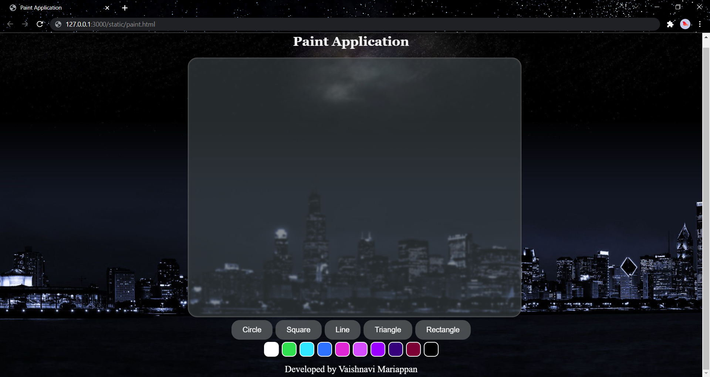

# Web Page for Paint Application

## AIM:

To design a static website for Paint Application using HTML5 canvas.

## DESIGN STEPS:

### Step 1:

Requirement collection.

### Step 2:

Creating the layout using HTML,CSS and canvas.

### Step 3:

Write javascript to capture move events.

### Step 4:

Perform the drawing operation based on the user input.

### Step 5:

Validate the layout in various browsers.

### Step 6:

Validate the HTML code.

### Step 6:

Publish the website in the given URL.

## PROGRAM :

### HTML:
```
<!DOCTYPE html>
<html lang="en">
<head>
    <meta charset="UTF-8">
    <meta http-equiv="X-UA-Compatible" content="IE=edge">
    <meta name="viewport" content="width=device-width, initial-scale=1.0">
    <title>Paint Application</title>
    <link rel="stylesheet" href="./css/style.css"/>
<script src="./js/myscript.js"></script>
</head>
<body>
    <h1>Paint Application</h1>
    <div class="container">
        <canvas id="myCanvas" height="700px" width="900px"></canvas>
    </div>
    <div class="shape">
        <input type="button" class="shapes" id="shape" value="Circle">
        <input type="button" class="shapes" id="shape1" value="Square">
        <input type="button" class="shapes" id="shape2" value="Line">
        <input type="button" class="shapes" id="shape3" value="Triangle">
        <input type="button" class="shapes" id="shape4" value="Rectangle">
    </div>
    <div class="col">
        <button onclick="change_color(this)" id="colors" style="background: white;"></button>
        <button onclick="change_color(this)" id="colors" style="background: rgb(49, 224, 78);"></button>
        <button onclick="change_color(this)" id="colors" style="background: rgb(49, 231, 255);"></button>
        <button onclick="change_color(this)" id="colors" style="background: rgb(46, 112, 255);"></button>
        <button onclick="change_color(this)" id="colors" style="background: rgb(223, 39, 213);"></button>
        <button onclick="change_color(this)" id="colors" style="background: rgb(213, 76, 255);"></button>
        <button onclick="change_color(this)" id="colors" style="background: rgb(153, 0, 255);"></button>
        <button onclick="change_color(this)" id="colors" style="background: rgb(54, 0, 124);"></button>
        <button onclick="change_color(this)" id="colors" style="background: rgb(124, 0, 52);"></button>
        <button onclick="change_color(this)" id="colors" style="background: rgb(0, 0, 0);"></button>

    </div>
    <br/>
    <div class="footer">Developed by Vaishnavi Mariappan</div>
    <script src="./js/myscript1.js">
       </script>
</body>
</html>
```
### CSS :
```
*
.container{
  padding-left: 500px;
}
h1{
  font-size: 35px;
  font-family: Georgia, 'Times New Roman', Times, serif;
  color: whitesmoke;
  text-align: center;
}
#myCanvas{
  background-color: #3e474998; 
  box-shadow: inset 0 0 5px #555252;
  backdrop-filter:blur(2px);
  height: 700px;
  width: 900px;
  text-align: center;
  border-radius: 25px;
  border: 1px solid #ffffff44;
}
.shape{
  text-align: center;
}
.shapes{
  background-color: #4d5053ef;
  border: 2px;
  border-radius: 22px;
  color: white;
  padding: 15px 30px;
  text-align: center;
  font-size: 20px;
  margin: 4px 2px;
  cursor: pointer;
}
body{
    background-image: url("/paintapp/static/img/hi.jpg");
    background-size: cover;
}
.footer{
  color: white;
  font-size: 25px;
  font-family:'Times New Roman', Times, serif;
  text-align: center;
}
.col{
  text-align: center;
}
#colors{
  border: 2px solid #ffffff;
  border-radius: 12px;
  padding: 18px 18px;
  display: inline-block;
  margin: 2px 2px;
  cursor: pointer;
}
```
### JS :
```
*
.container{
  padding-left: 500px;
}
h1{
  font-size: 35px;
  font-family: Georgia, 'Times New Roman', Times, serif;
  color: whitesmoke;
  text-align: center;
}
#myCanvas{
  background-color: #3e474998; 
  box-shadow: inset 0 0 5px #555252;
  backdrop-filter:blur(2px);
  height: 700px;
  width: 900px;
  text-align: center;
  border-radius: 25px;
  border: 1px solid #ffffff44;
}
.shape{
  text-align: center;
}
.shapes{
  background-color: #4d5053ef;
  border: 2px;
  border-radius: 22px;
  color: white;
  padding: 15px 30px;
  text-align: center;
  font-size: 20px;
  margin: 4px 2px;
  cursor: pointer;
}
body{
    background-image: url("/paintapp/static/img/hi.jpg");
    background-size: cover;
}
.footer{
  color: white;
  font-size: 25px;
  font-family:'Times New Roman', Times, serif;
  text-align: center;
}
.col{
  text-align: center;
}
#colors{
  border: 2px solid #ffffff;
  border-radius: 12px;
  padding: 18px 18px;
  display: inline-block;
  margin: 2px 2px;
  cursor: pointer;
}
```
```
var c = document.getElementById("myCanvas");
var ctx = c.getContext("2d");
let hello="#FFFFFF";
shape=0;
let t=40;
let s=150;
ctx.beginPath();
ctx.stroke();
c.addEventListener("click", myClickEvent);
document
.getElementById("shape")
.addEventListener("click", circleclicked);
document
.getElementById("shape1")
.addEventListener("click", squareclicked);
document
.getElementById("shape2")
.addEventListener("click", lineclicked);
document
.getElementById("shape3")
.addEventListener("click", triangleclicked);
document
.getElementById("shape4")
.addEventListener("click", rectangleclicked);
```
## OUTPUT:




## Result:

Thus a website is designed and validated for paint application using HTML5 canvas.
